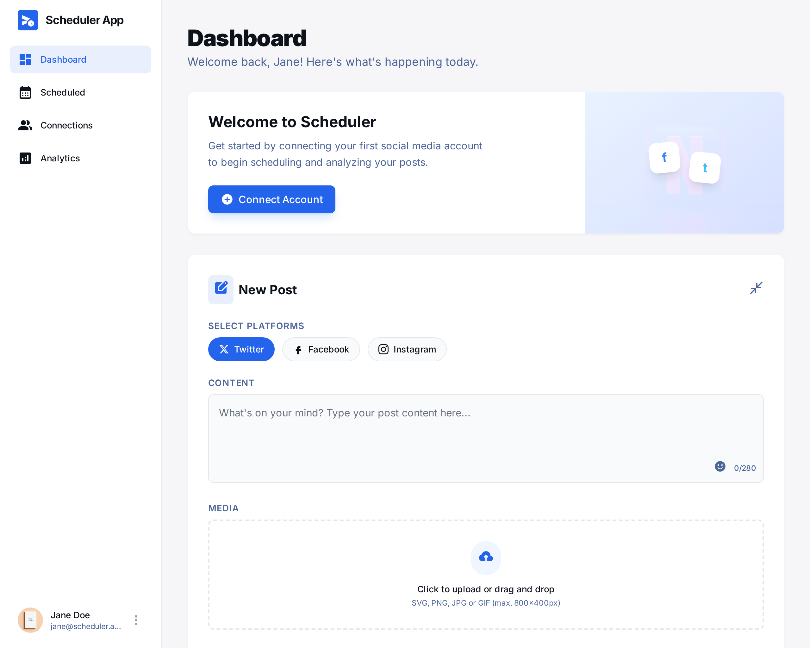

# Social Scheduler

A high-performance, fintech-grade social media scheduling application built with Next.js 14. Designed for precision, security, and scalability using a modern serverless stack.



## 🚀 Tech Stack

- **Frontend**: Next.js 14 (App Router), React 18, TypeScript
- **UI System**: Tailwind CSS with "Fintech" aesthetic (Inter font, precision spacing)
- **Authentication**: Clerk (Secure User Management)
- **Database**: Supabase (PostgreSQL with Row Level Security)
- **File Storage**: Cloudflare R2 (S3-compatible object storage)
- **Job Scheduling**: Trigger.dev v3 (Serverless Task Scheduling) / Upstash QStash (Legacy/Fallback)
- **Deployment**: Vercel

## ✨ Key Features

- **Professional Dashboard**: High-contrast, data-dense UI optimized for productivity.
- **Multi-Platform OAuth**: Secure connections to Facebook, Instagram, Twitter, and LinkedIn (Encryption at rest).
- **Smart Scheduling**: Schedule posts with precision timing using Trigger.dev v3.
- **Media Management**: Fast, secure uploads to Cloudflare R2 with instant previews.
- **Role-Based Security**: Strict RLS policies ensuring data privacy.

## 🛠️ Installation & Setup

### 1. Clone & Install
```bash
git clone <repository-url>
cd social-scheduler
npm install
```

### 2. Environment Setup
Copy the example file and fill in your keys:
```bash
cp .env.local.example .env.local
```

**Required Keys:**
- `NEXT_PUBLIC_CLERK_PUBLISHABLE_KEY` & `CLERK_SECRET_KEY`
- `NEXT_PUBLIC_SUPABASE_URL` & `NEXT_PUBLIC_SUPABASE_ANON_KEY`
- `SUPABASE_SERVICE_ROLE_KEY` (Required for server-side operations)
- `R2_ACCOUNT_ID`, `R2_ACCESS_KEY_ID`, `R2_SECRET_ACCESS_KEY`, `R2_BUCKET_NAME`
- `TRIGGER_SECRET_KEY` (For scheduling)
- `FACEBOOK_APP_ID` & `FACEBOOK_APP_SECRET` (For OAuth)

### 3. Database Migration
Run the SQL schema provided in `supabase/schema.sql` in your Supabase SQL Editor to set up tables and RLS policies.

### 4. Cloudflare R2 CORS
To enable uploads, update your R2 Bucket CORS policy:
```json
[
  {
    "AllowedOrigins": ["http://localhost:3000", "https://your-vercel-domain.app"],
    "AllowedMethods": ["GET", "PUT", "POST", "DELETE", "HEAD"],
    "AllowedHeaders": ["*"],
    "ExposeHeaders": ["ETag"],
    "MaxAgeSeconds": 3600
  }
]
```

### 5. Run Development Server
```bash
npm run dev
```

## 🚀 Deployment

1. **Deploy to Vercel**: Push to your repository.
2. **Deploy Trigger.dev Tasks**:
   ```bash
   npx trigger.dev@latest login
   npx trigger.dev@latest deploy
   ```
   *This ensures your scheduling tasks run in the cloud.*

## 📁 Project Structure

```
social-scheduler/
├── src/
│   ├── app/              # Next.js App Router (Routes & API)
│   ├── components/       # Reusable UI Components
│   ├── lib/              # Core Logic (DB, R2, OAuth)
│   ├── trigger/          # Background Tasks (Publishing Logic)
│   └── types/            # TypeScript Definitions
├── design-assets/        # Original UI/UX References
└── docs/                 # Detailed Tech Specs & Guides
```

## 🔐 Security

- **RLS Enabled**: Database tables are protected by Row Level Security.
- **Encrypted Tokens**: OAuth tokens are encrypted before storage.
- **Service Role**: Server-side operations use privileged keys strictly where necessary.

## 📝 License

MIT