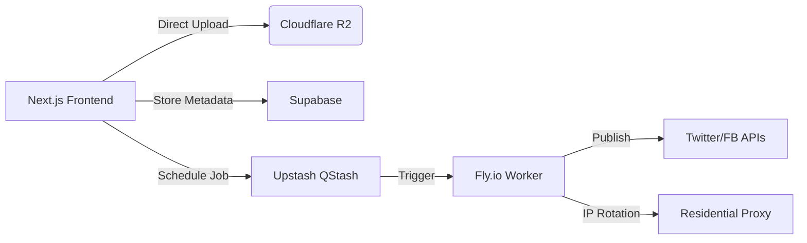

# Social Scheduler - Zero-Budget Technical Spec
*Strictly free-tier compliant | Last updated: 2025-12-31*

## 🔑 Required Free Accounts

| Service       | Setup Link                                  | Critical Limits               |
|---------------|---------------------------------------------|-------------------------------|
| Vercel        | https://vercel.com/signup                   | 100GB bandwidth/mo            |
| Supabase      | https://supabase.com/dashboard              | 500MB DB, 1GB storage         |
| Clerk         | https://clerk.com/dashboard                 | 10k MAU                       |
| Upstash QStash| https://console.upstash.com/qstash          | 10k messages/mo               |
| Cloudflare R2 | https://dash.cloudflare.com/r2              | 10GB storage + 1M ops/mo      |
| Fly.io        | https://fly.io/dashboard                    | $5/mo credit (200k API calls) |

## ⚙️ Core Architecture



🗄️ Supabase Schema (Run in SQL Editor)

```sql
CREATE EXTENSION IF NOT EXISTS "uuid-ossp";

CREATE TABLE social_connections (
  id UUID PRIMARY KEY DEFAULT uuid_generate_v4(),
  user_id TEXT NOT NULL,
  platform TEXT NOT NULL CHECK (platform IN ('twitter','facebook')),
  encrypted_access_token TEXT NOT NULL,
  created_at TIMESTAMPTZ DEFAULT NOW()
);

CREATE TABLE scheduled_posts (
  id UUID PRIMARY KEY DEFAULT uuid_generate_v4(),
  user_id TEXT NOT NULL,
  content TEXT NOT NULL CHECK (char_length(content) <= 280),
  media_urls TEXT[] DEFAULT '{}',
  scheduled_at TIMESTAMPTZ NOT NULL,
  platform TEXT NOT NULL CHECK (platform IN ('twitter','facebook')),
  status TEXT NOT NULL DEFAULT 'pending' CHECK (status IN ('pending','published','failed'))
);

-- Enable RLS
ALTER TABLE social_connections ENABLE ROW LEVEL SECURITY;
ALTER TABLE scheduled_posts ENABLE ROW LEVEL SECURITY;

CREATE POLICY "User access" ON social_connections FOR ALL TO authenticated USING (user_id = auth.uid());
CREATE POLICY "User posts" ON scheduled_posts FOR ALL TO authenticated USING (user_id = auth.uid());
```

🚀 Deployment Steps

### 1. Frontend Setup (Vercel)

```bash
npx create-next-app social-scheduler --ts --tailwind --app --src-dir
cd social-scheduler
npm install @clerk/nextjs @supabase/supabase-js @upstash/qstash @uppy/core @uppy/dashboard @uppy/aws-s3-multipart dayjs
```

### 2. Critical Environment Variables (.env.local)

```env
NEXT_PUBLIC_CLERK_PUBLISHABLE_KEY=pk_test_...
CLERK_SECRET_KEY=sk_test_...
NEXT_PUBLIC_SUPABASE_URL=your-supabase-url
NEXT_PUBLIC_SUPABASE_ANON_KEY=your-anon-key
QSTASH_TOKEN=your-qstash-token
QSTASH_CURRENT_SIGNING_KEY=your-current-key
QSTASH_NEXT_SIGNING_KEY=your-next-key
PUBLISHING_WEBHOOK_SECRET=generate_strong_32_char_secret
R2_ACCOUNT_ID=your-r2-account-id
R2_ACCESS_KEY_ID=your-r2-key-id
R2_SECRET_ACCESS_KEY=your-r2-secret-key
R2_BUCKET_NAME=social-scheduler
R2_PUBLIC_DOMAIN=https://social-scheduler.your-subdomain.workers.dev
```

### 3. Essential API Routes

**File: `src/app/api/r2/companion/route.ts`**

```typescript
export const runtime = 'nodejs';
import { createPresignedPost } from '@uppy/companion/lib/S3Client';
import { NextResponse } from 'next/server';

export async function POST(req: Request) {
  const { filename, contentType } = await req.json();
  const key = `uploads/${Date.now()}_${filename}`;
    
  const presigned = await createPresignedPost({
    Bucket: process.env.R2_BUCKET_NAME!,
    Key: key,
    Conditions: [['content-length-range', 0, 10485760]], // 10MB
    Fields: { 'Content-Type': contentType },
    Expires: 60,
  }, {
    accessKeyId: process.env.R2_ACCESS_KEY_ID!,
    secretAccessKey: process.env.R2_SECRET_ACCESS_KEY!,
    region: 'auto',
    endpoint: `https://${process.env.R2_ACCOUNT_ID}.r2.cloudflarestorage.com`,
  });

  return NextResponse.json({
    url: `${process.env.R2_PUBLIC_DOMAIN}/${key}`,
    fields: presigned.fields
  });
}
```

**File: `src/app/api/schedule/route.ts`**

```typescript
import { NextResponse } from 'next/server';
import { createClient } from '@supabase/supabase-js';
import { Qstash } from '@upstash/qstash';

const supabase = createClient(
  process.env.NEXT_PUBLIC_SUPABASE_URL!,
  process.env.NEXT_PUBLIC_SUPABASE_ANON_KEY!
);

export async function POST(req: Request) {
  const { content, mediaUrls, scheduledAt, platform, userId } = await req.json();
    
  // Save to Supabase
  const { data } = await supabase
    .from('scheduled_posts')
    .insert([{ user_id: userId, content, media_urls: mediaUrls, scheduled_at: scheduledAt, platform }])
    .select()
    .single();

  // Schedule with QStash
  const qstash = new Qstash({ token: process.env.QSTASH_TOKEN! });
  await qstash.publishJSON({
    url: 'https://your-fly-app.fly.dev/publish',
    delay: new Date(scheduledAt).getTime() - Date.now(),
    body: { postId: data.id, userId },
    headers: { 'x-webhook-secret': process.env.PUBLISHING_WEBHOOK_SECRET! }
  });

  return NextResponse.json(data);
}
```

### 4. Fly.io Publishing Worker (Separate Project)

**File: `fly.toml`**

```toml
app = "scheduler-worker"
kill_signal = "SIGINT"
kill_timeout = 5

[env]
  SUPABASE_URL = "your-supabase-url"
  SUPABASE_SERVICE_KEY = "your-service-role-key" # From Supabase settings

[[services]]
  internal_port = 8080
  protocol = "tcp"
  [[services.ports]]
    port = "80"
    handlers = ["http"]
```

**File: `src/index.ts` (Critical Logic Only)**

```typescript
import { Hono } from 'hono';
import { verifySignature } from '@upstash/qstash/nextjs';

const app = new Hono();

// QStash verification middleware
app.use('/publish', async (c, next) => {
  await verifySignature({ /* config */ }); // Full config in production
  await next();
});

app.post('/publish', async (c) => {
  const { postId, userId } = await c.req.json();
    
  // 1. Fetch post from Supabase
  // 2. Decrypt tokens (using user-specific key)
  // 3. Publish via Twitter/FB API with rotating proxy
  // 4. Update post status
    
  return c.json({ success: true });
});

export default app;
```

⚠️ Cost Kill Switches (Monitor Daily)

*   **Supabase:** Alert when bandwidth > 800MB
*   **Upstash:** Auto-pause scheduling at 9,500 messages
*   **Fly.io:** Set spend limit to $4.50/mo
*   **Cloudflare:** Block uploads when >9GB used

▶️ First Build Commands

```bash
# Frontend
vercel --prod

# Worker
fly deploy --remote-only
fly secrets set SUPABASE_SERVICE_KEY=... PUBLISHING_WEBHOOK_SECRET=...
```

**WARNING:** Never store raw social tokens. Always encrypt in browser using Web Crypto API before sending to Supabase.
